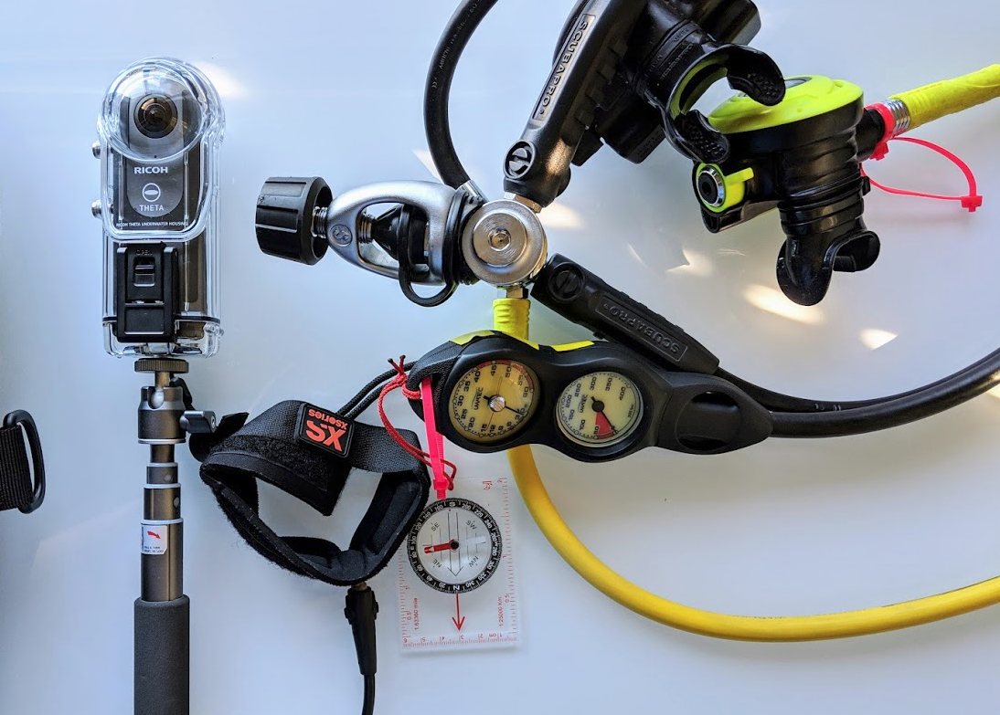
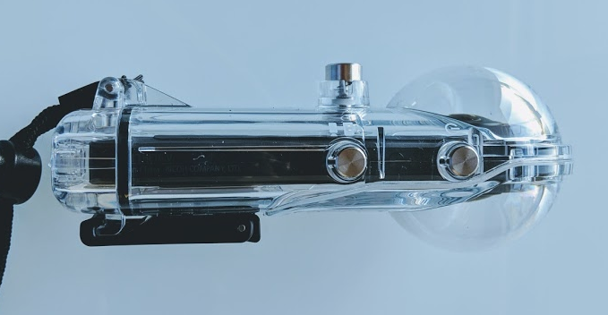

# RICOH THETA SCUBA Plug-in

For recreational and scientific diving.

## Features
* takes 1,000 pictures at 4 second intervals
* this will give you 66 minutes of recording

## workflow

* Set plug-in to load by default
* put into RICOH TW-1 Underwater Housing for THETA V
* mount underwater case on underwater tripod
* put tripod in underwater work area
* press lower side button on underwater case for longer than 2 seconds
to enable plug-in mode
* press shutter button to start recording
* press shutter button to stop recording
* in the lab or home, create timelapse video for review by team
* if area warrants further inspection, use full resolution image to
zoom in.

## Additional Benefits

Cannot use Wi-Fi button when the THETA is in the underwater case.
This prevents the camera from being put into self-timer mode.
You can use this plug-in like a self-timer and discard the pictures
that you don't want to use.

